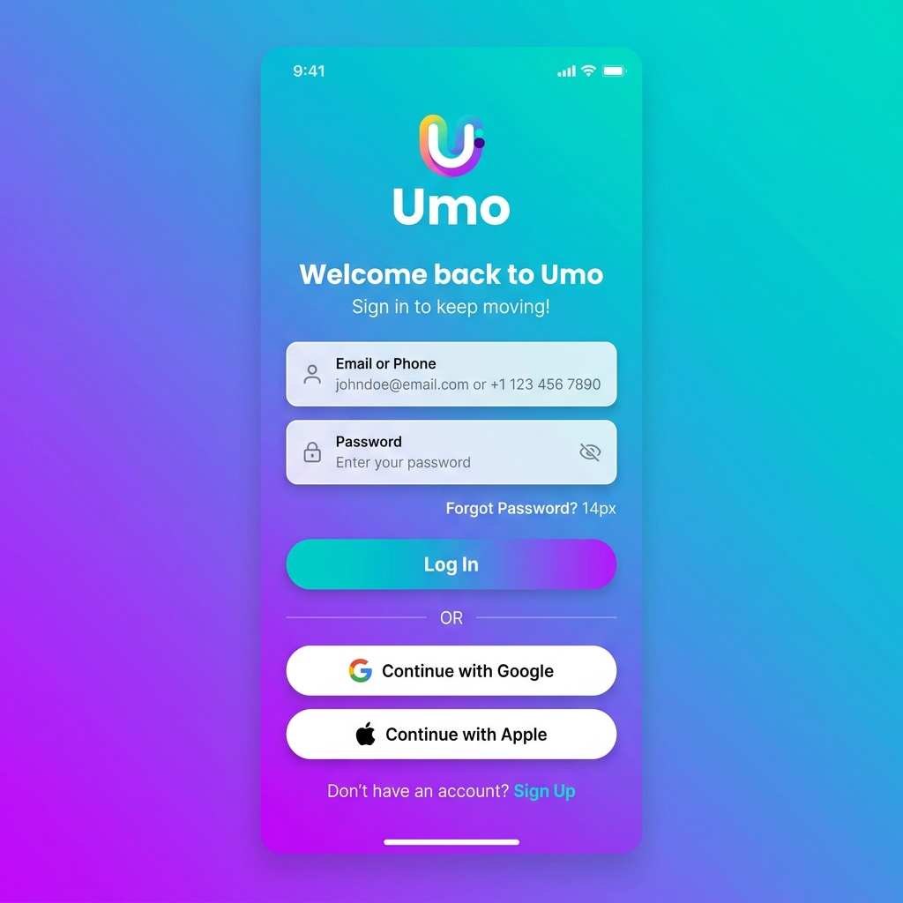
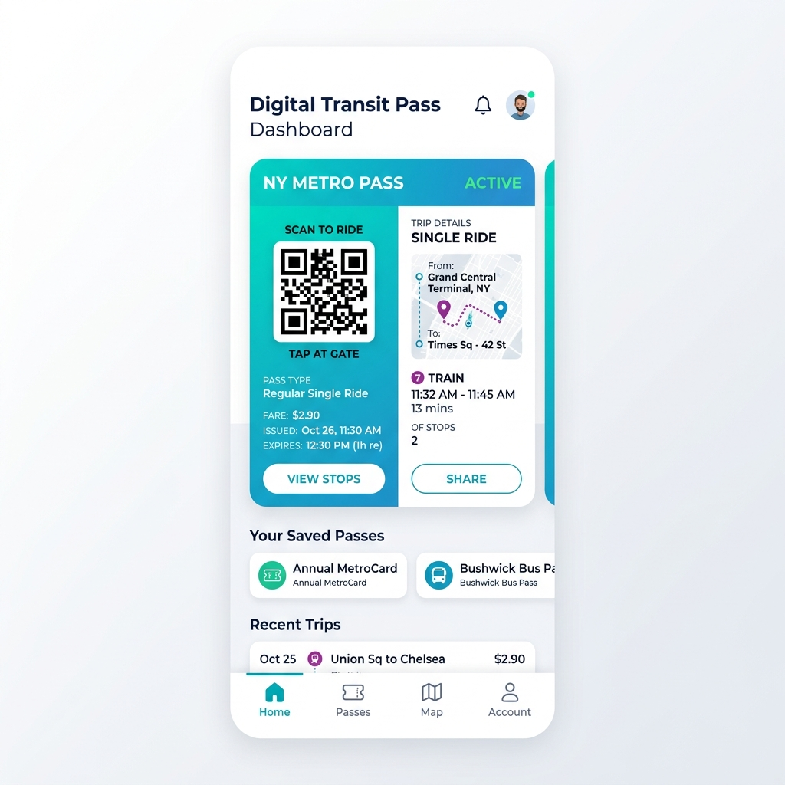

<div align="center">
  <h1>🚀 Umo Mobility iOS SDK</h1>
  <p>
    <strong>A robust, reliable, and seamless passenger authentication and mobility SDK for iOS.</strong>
  </p>
  <p>
    <a href="https://github.com/TejasPatil-TP/umomobility/issues">Report Bug</a>
    ·
    <a href="https://github.com/TejasPatil-TP/umomobility/issues">Request Feature</a>
  </p>
</div>

---

## 🌟 About The Project

**Umo Mobility iOS SDK** provides a seamless integration for passenger authentication, pass management, rewards, and ads directly into your iOS applications. Under the hood, this SDK leverages the power of Flutter frameworks embedded as `.xcframework` components, offering a unified, cross-platform UI/UX tailored specifically for the native iOS environment.

### 🔑 Key Modules Included:

- **UmoAuthSdk:** Core passenger authentication (utilizing AWS Amplify Cognito).
- **CubicAuth:** Supporting authentication frameworks.
- **UmoPass:** Passenger ticket and pass management.
- **UmoRewards:** Gamification and rewards integration.
- **UmoAds:** Embedded mobility ad capabilities.

---

## 📸 Screenshots

<div align="center">
  
  &nbsp;&nbsp;&nbsp;&nbsp;
  
  &nbsp;&nbsp;&nbsp;&nbsp;
  
</div>

---

## ✨ Features

- **Fluid UI:** Beautiful, responsive UI mapped through Flutter to native iOS.
- **Secure Authentication:** Pre-baked AWS Amplify Cognito logic for maximum enterprise security.
- **Modular Architecture:** Only install the modules you absolutely need.
- **Latest Swift Support:** Specifically tailored for iOS 13.0+ and SPM/CocoaPods integration.

---

## 🛠 Prerequisites

- iOS 13.0+ (iOS 17.0+ recommended for SPM)
- Xcode 15+
- Swift 5.0+

---

## 📦 Installation

You can install the Umo Mobility suite via **CocoaPods** or **Swift Package Manager (SPM)**.

### Option 1: Swift Package Manager (Recommended)

1. In Xcode, navigate to **File > Add Package Dependencies**.
2. Enter the repository URL for `UmoAuthSdk` (or your chosen repo).
3. Ensure the targets `UmoAuthSdk`, `App`, `Flutter`, and other dependencies are linked to your binary.

### Option 2: CocoaPods

Add the specific toolsets you need to your `Podfile`:

```ruby
# Core Authentication
pod 'UmoAuthSdk', '~> 1.0.12'

# Auxiliary Modules
pod 'CubicAuth'
pod 'UmoPass'
pod 'UmoRewards'
pod 'UmoAds'
```

Next, run the installation command in your terminal:

```bash
pod install
```

---

## 💻 Usage

To get started with the Umo Auth module in your `AppDelegate` or `SceneDelegate`:

```swift
import UIKit
import UmoAuthSdk
import Flutter

@UIApplicationMain
class AppDelegate: FlutterAppDelegate {
    override func application(
        _ application: UIApplication,
        didFinishLaunchingWithOptions launchOptions: [UIApplication.LaunchOptionsKey: Any]?
    ) -> Bool {
        // Initialize your Umo Auth SDK environment here
        // UmoAuthManager.shared.configure(...)

        return super.application(application, didFinishLaunchingWithOptions: launchOptions)
    }
}
```

> **Note:** Since this SDK uses Flutter `.xcframework` bundles under the hood, your application may require registering a `FlutterEngine` or subclassing `FlutterAppDelegate`.

---

## 📄 License

Distribted under the Proprietary License. See `LICENSE` for more information.

---

## 📬 Contact

**Tejas Patil** - [GitHub: @TejasPatil-TP](https://github.com/TejasPatil-TP)

Project Link: [https://github.com/TejasPatil-TP/umomobility](https://github.com/TejasPatil-TP/umomobility)
